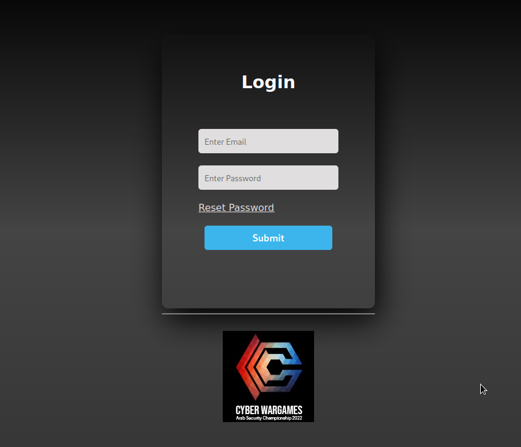
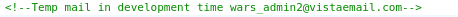
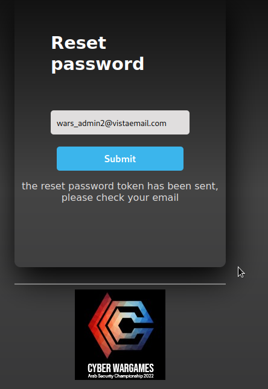
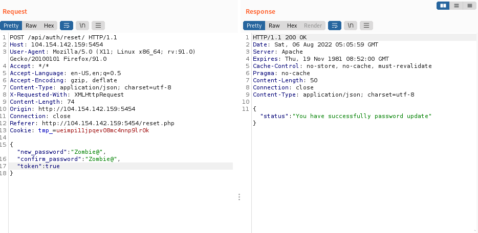

# Drunken Developer (100)

## Challenge Description
The goal of the challenge is to reset the admin account password through the reset password function.


## Challenge Files
Looking at the source code of the webpage reveals a developer admin email in a comment.


```
wars_admin2@vistaemail.com
```

After resetting the password, a password reset token is sent to the corresponding email. However, without this email and token, it seems like we can not reset the password.


Going through the source code, a js file is found with the following interesting bit

```
$(document).ready(function(){
    $('#resetpassword').on('submit', function(e){
        e.preventDefault();
        var register = $('#resetPassword').val();

        $.ajax({
            url: 'api/auth/reset/',
            type: 'POST',
            data: JSON.stringify( { "new_password": $('#newPassword').val(), "confirm_password":$('#newPasswordConfirm').val(), "token":$('#token').val() } ),
            contentType: "application/json; charset=utf-8",
            
            success: function(data){
                if (JSON.stringify(data.status)){
                document.getElementById("message").innerHTML = JSON.stringify(data.status).replace('"',"").replace('"',"");
                
                } else if (JSON.stringify(data.error)) {
                    document.getElementById("message").innerHTML = JSON.stringify(data.error).replace('"',"").replace('"',"");
                }
            }
        });
    });
    });
```
It seems we can reset the password by supplying the new password and the password token.

## Solution
The web app is written in php which a common attack in CTFs is to check for loose comparison e.g '==' instead of '==='. The web app also uses json data which can include different data types such as booleans instead of only strings. I tried bypassing the token authentication by supplying the boolean value true which if the web app uses loose comparison will evaluate to true. It worked and the password was succesfully reset.



Logging in presents us with the flag.

## Flag
```
ASCWG{%Sca21_QS_2!3eSKC&qw9@_warmup}
```


