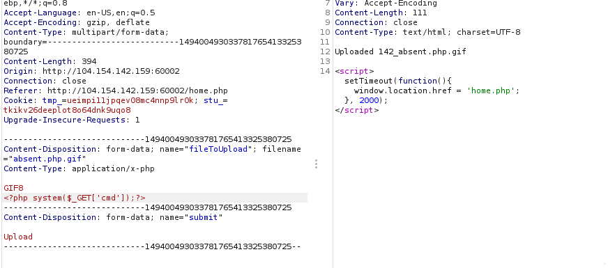
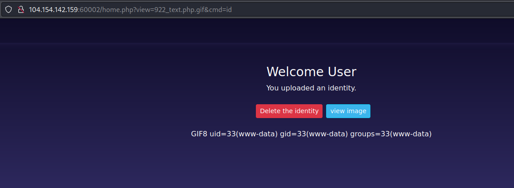
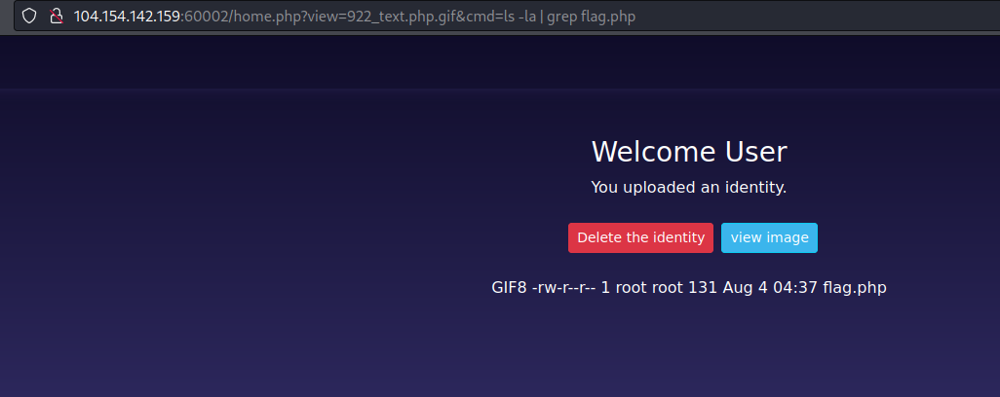

# Evil Volunteer (600) 

## Challenge Description
The challenge is a arbitrary file upload attack leading to RCE

## Challenge Files
The web app allows you to register and upload an image file as your profile picture.


## Solution
The web app does not have sufficient checks for users to upload mallicious files. Bypassing the checks by supplying double extensions and adding the correct mime type is enough to bypass the filters.



Uploading a webshell leads to RCE, ls and cat to show the flag.





## Flag
```
ASCWG{f$@wef#23_4_as_KR_qwq21_21aasd_medium_1}
```