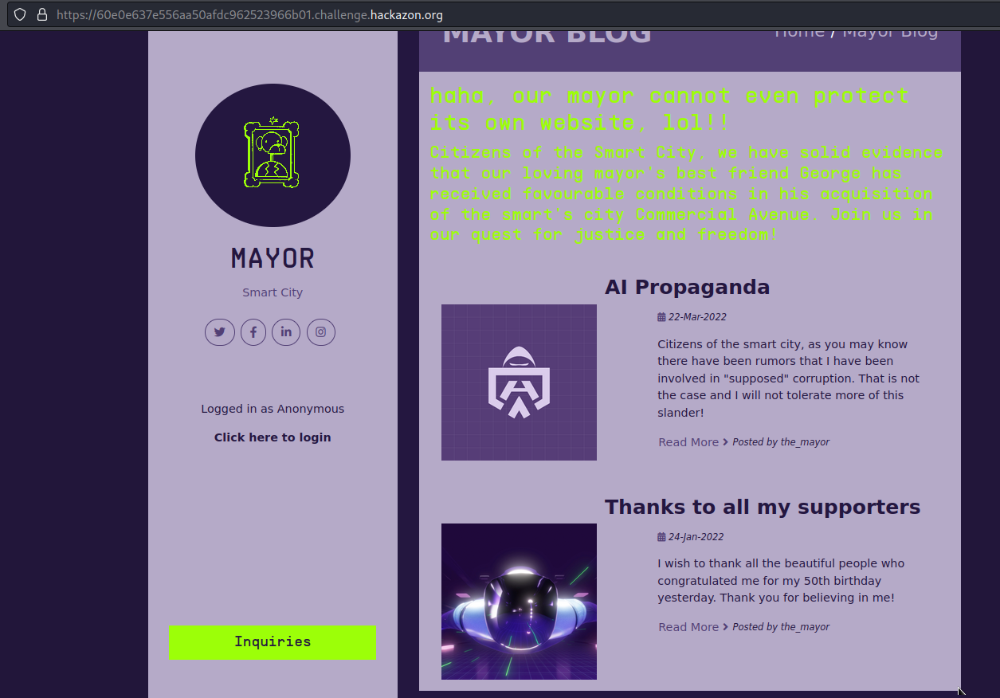
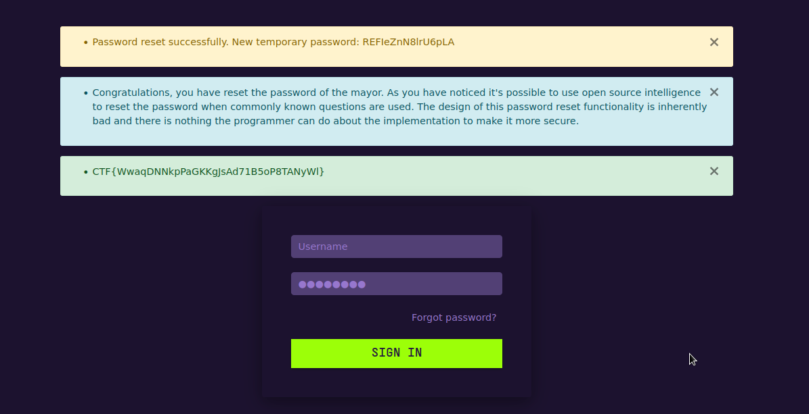

# Mayor's Blog Web(125) 

## Challenge Description
A blogpost website with various beginner friendly challenges.


## Flag 1
There is a hidden flag in the webpage. Can you find it?

**Solution**
Flag is in server response header
Content-Security-Policy: CTF{xjDmWhLh3VHKip8NHYLRwbgoXmwaq5RG}

## Flag 2
Try to exploit the password resetting functionality to gain access to an account.

**Solution**
A forgot password feature is implemented with 2 security questions, best friend from childhood and birthdate. We can reset the_mayor's password with the information gathered from the blogposts on the front page. Successfully answering these questions present us with the second flag.



CTF{WwaqDNNkpPaGKKgJsAd71B5oP8TANyWl}

## Flag 3
It looks like the design of the authentication system is very flawed. Find out how users are authenticated and exploit the system to gain Administrator rights.

**Solution**
Logging in as the mayor shows we only have editor rights. Admin authentication is done by checking session cookie 'isAdmin', changing it to True elevates our privileges. Once we have admin rights, we are able to view server logs and the third flag.

CTF{np3QKOEmYBJNcDaFuo3dcZQ8D1Pbeh4G}

## Flag 4
There is special console for administrators on the website, but the link is hidden. Find the link, and gain relevant information from the logs. In the end, use the console to find user information.

**Solution**
Checking robots.txt shows us a hidden directory '/admin_shell', accessing the page gives us an error, we need the system admin account to access this page. Going back to the server logs, we can see a log where the system admin logs in with their username and password, this is due to the website using GET request for the log in fucntion.
```
127.0.0.1 - - [26/Jun/2022:11:20:31 -0700] "GET /logging_in?username=sysadmin&password=JK28Qgb4WA3uuYa4 HTTP/1.1" 302 208 "http://mayorblog.local/login" "Mozilla/5.0 (X11; Ubuntu; Linux x86_64; rv:99.0) Gecko/20100101 Firefox/99.0"
```
Accessing /admin_shell presents us with a web shell where we can only input 'ls' and 'cat', cat ./user.txt presents us the fourth flag.

CTF{3kdN6P8sEBLJyxHwsQlEgWVY2g3BBfan}

## Flag 5
Find a vulnerability in the developer console and use it to access a password file.

**Solution**
cat /etc/shadow is allowed without restrictions which reveals the hash of an admin user, 0b3364569955a095cd07ba6bad26091d. Checking crackstation reveals the password.

flag is the password: iloveyou


